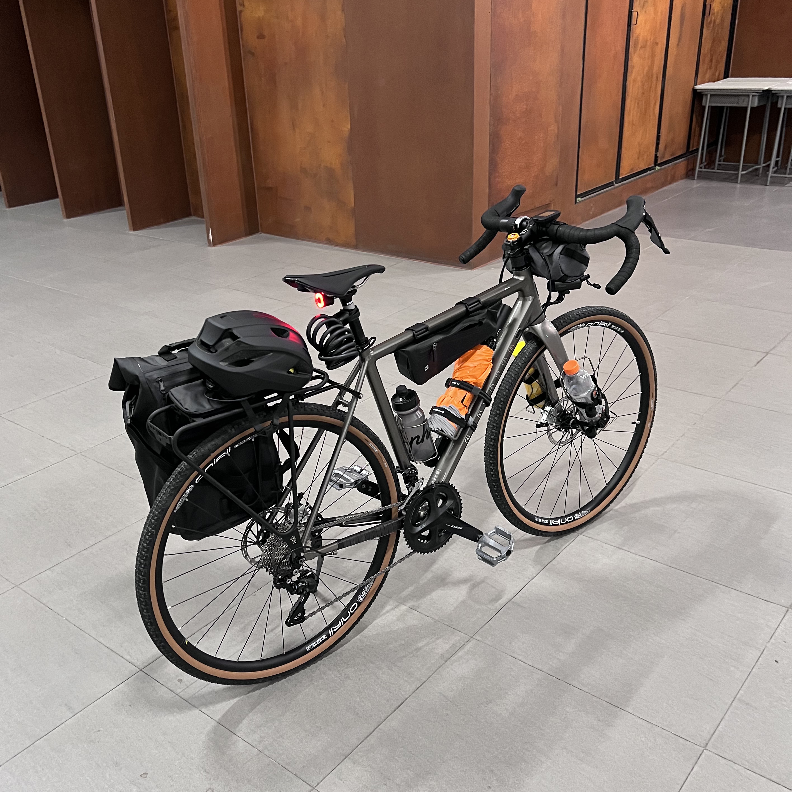



Hi there :wave:

You clicked the link, so I assume you have some interest in me. Here is more for you.

## Biography

JIANG, Zixing (蒋, 子星) was born and raised in [Shengzhou (嵊州)](https://en.wikipedia.org/wiki/Shengzhou), Zhejiang Province, China. He moved to Shenzhen to study after he graduated from Shengzhou Senior Middle School in 2019. Currently, he is pursuing a B.Eng. degree at The Chinese University of Hong Kong, Shenzhen (CUHK-Shenzhen). During his undergraduate studies, he was fortunate to get involved in research at the Robotics and Artificial Intelligence Laboratory (RAIL) at CUHK-Shenzhen. This research experience sparked his love for robotics. Therefore, he decided to pursue a higher degree in this field and commit himself to the robotics industry. His research interests include robotics, robot-assisted medical procedures, and human-machine interaction. 

## The Future I Purse

I want to see the day when technology can eliminate the inequalities that humans are born with (these two videos [[1]](https://www.youtube.com/watch?v=pJ6YV9-qxmg), [[2]](https://www.youtube.com/watch?v=CnMIYzU99yg) touched me a lot). Imagine how wonderful it would be if disabled people wearing prosthetics could walk the catwalks at Fashion Week with the same confidence as normal models. With this dream in mind, I’m particularly obsessed with applying robotics in healthcare and education, and am willing to devote myself to it.

## Things I Like & Hate

## In My Spare Time

 In my spare time, 

- I watch :checkered_flag: [F1](https://www.formula1.com/) (Red Bull Racing), :soccer: [Premier League](https://www.premierleague.com/) (Manchester City), and :bicyclist: [UCI World Tour](https://www.uci.org/) (Team Jumbo Vsima & UAE Team Emirates). 
- I am an enthusiastic but casual :video_game: gamer. The games I often play include: [It Takes Two](https://www.ea.com/games/it-takes-two), [Sid Meier's Civilization VI](https://civilization.com/), [Fall Guys](https://www.fallguys.com/en-US), [Forza Horizon 5](https://www.xbox.com/en-US/games/forza-horizon-5), and [World of Tanks Blitz](https://na.wotblitz.com/en/).  
- I am a fan of Japanese/Chinese anime and comics.  My favorite works include: 
	- [風が強く吹いている]() (Run with the Wind, 强风吹拂) 
	- [ぼっち·ざ·ろっく!]() (Bocchi the Rock!, 孤独摇滚!) 
	- [オッドタクシー]() (Odd Taxi, 奇巧计程车) 
	- [サイバーパンク エッジランナーズ]() (Cyberpunk: Edgerunners, 赛博朋克：边缘行者)
	- [チェンソーマン]() (Chainsaw Man, 电锯人) 
	- [ジョジョの奇妙な冒険]() (JoJo's Bizarre Adventure, JoJo的奇妙冒险) 
	- [ぐらんぶる]() (Grand Blue, 碧蓝之海) 
	- [刺客伍六七]() (Scissor Seven)
	- [一人之下]() (Under One Person) 
	- [中国奇谭]() (Yao-Chinese Folktales)
- I browse cooking videos and recipes online and try to replicate them myself. Sometimes I feel like a talented chef and sometimes I feel like I'm wasting food.
- I release my negative emotions by jogging, bikepacking, and gravel riding. Here is a gravel & bikepacking bike a assembled my self. 

## Connections
