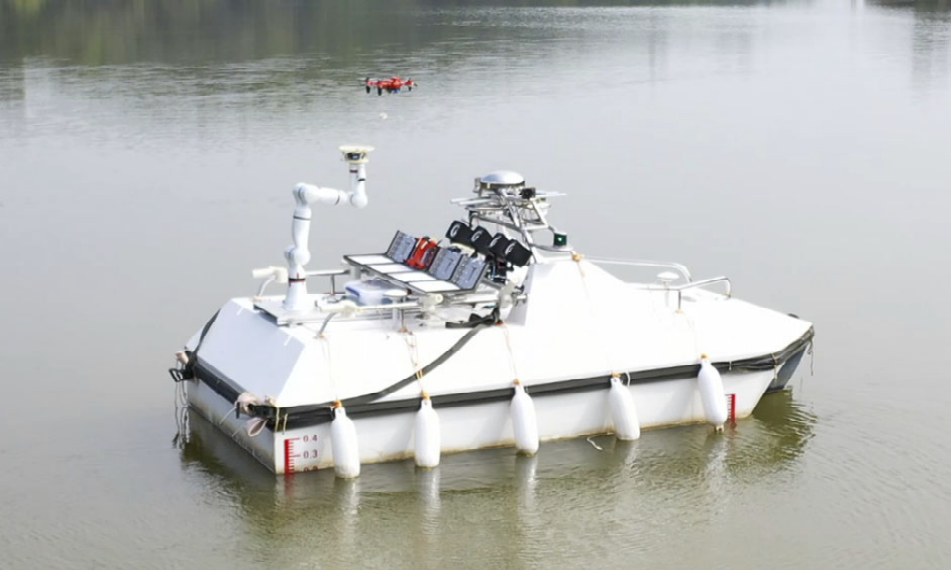



* Final year project at CUHK-SZ. 
* Sept. 2022 - Jan. 2023
* Supervisor: [Prof. Huihuan Alex QIAN](https://sse.cuhk.edu.cn/en/faculty/qianhuihuan)

## Background

This project originated from the UAV-USV collaborative system project of the [RAIL Advanced Marine Robotics Group](https://rail.cuhk.edu.cn/team/260) of the Chinese University of Hong Kong (Shenzhen). The system is dedicated to allowing UAV and UAV to cooperate autonomously like an aircraft carrier to complete some tasks on the ocean. To know more about the system, here is a [preprint](https://arxiv.org/abs/2212.12196).

In such a UAV-USV collaborative system, an unavoidable problem is **how to safely land the UAV on the USV**. The solution proposed by Advancedd Marine Robotics Group is to use an onboard manipulator to assist the UAV in landing. 

## Problem statement

## Methodology

## Demonstration

Here is a video demonstration of simulation 
<video src="/files/grasp_sim.mov" controls="controls" style="max-width: 769px;">
</video>

## Acknowledgement

## Related links